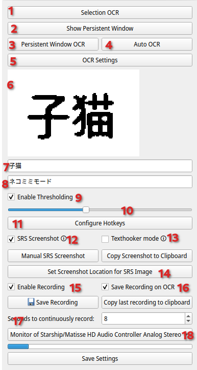

# Migaku OCR

| :exclamation:  This project is in a functional state, but *not* actively maintained and *not* supported by Migaku |
|-------------------------------------------------------------------------------------------------------------------|

## Info

### TODOs

* Download ffmpeg dynamically if not available
* Fix pyinstaller builds for windows and macos
* Add support for other languages
* Add support for other OCR engines

### Known Issues

* There might be issues with recording on windows
* On macOS, screenshots are taken in the wrong location

| :zap: We'd be happy to get help with these issues! |
|----------------------------------------------------|

### Features

1. select a region to ocr
2. show a window that you can drag around with left click and resize with right click. Press enter to close it and remember the position
3. do ocr on the location of the persistent window (or its last position if it was closed)
4. auto ocr, ocrs the persistent window every time a change is detected
5. open settings
6. the last screenshot after post processing
7. history 1
8. history 2
9. whether thresholding is used on the image, thresholding is used to make the image black and white and therefore easier to read for the OCR engine
10. adjust the thresholding value
11. hotkey settings
12. whether a screenshot is taken after ocr
13. texthooker mode, with this a screenshot is taken after a change in the clipboard is detected
14. set the location of the srs screenshot
15. enable recording your audio
16. whether the recording is stopped and saved on ocr
17. how many seconds are continuously recorded
18. which audio device is used for recording

## Installation Instructons

### From source

* Install `poetry` (might be called `python-poetry`) with your package manager
* Install `tesseract`, `ffmpeg`, `tesseract-data-jpn` and `tesseract-data-jpn_vert` (the last two are part of `tesseract-lang` in homebrew)
* Install dependencies with `poetry install`
* Run application with `poetry run python ocr_tool.py`
